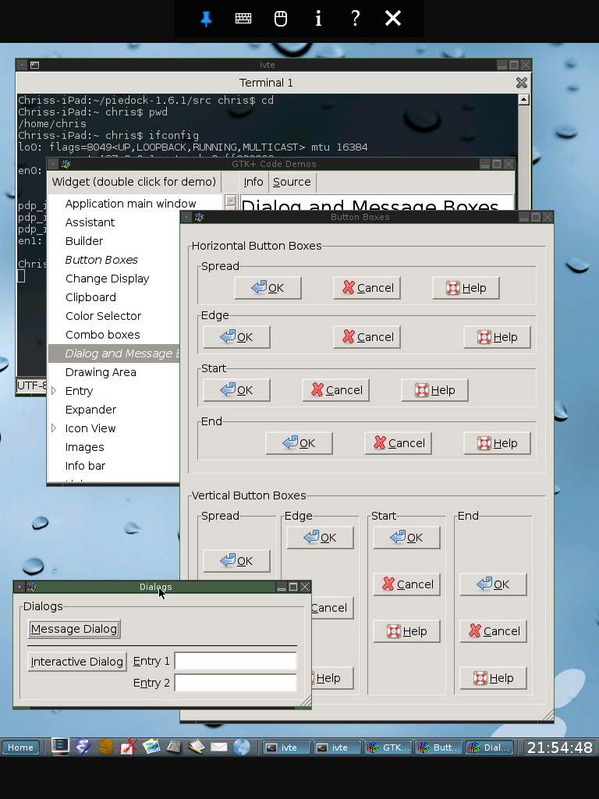

# QMole Screenshots

## Happy Hacking!

                        Powerloom-Reasoning-System.png
                                           
                         QMole-iphone-File-Manager.png
                                           SNORT-Network-Security-Scanner-Audit-Your-Wifi-Hotspot.png
Lua-on-iPhone.png                                          TCPDump-Hotspot-Network-Capture1.png
NMAP-Network-Discovery-Tool.png                            TCPDump-Hotspot-Network-Capture2.png
OCaml-Coq-IDE.png                                          ipython-notebook-on-iphone.png
OCaml-Coq-Proof-Tool.png                                   ipython-notebook-on-iphone2.png

