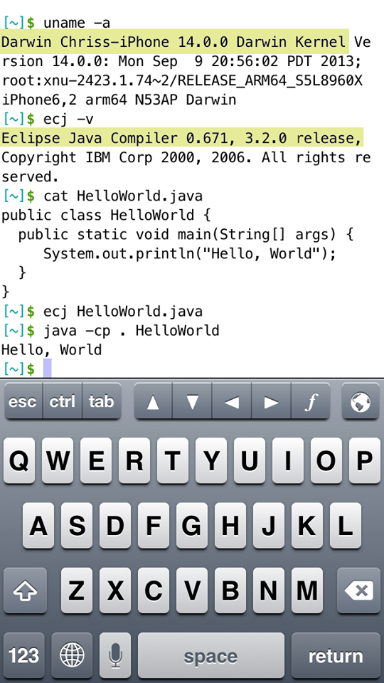
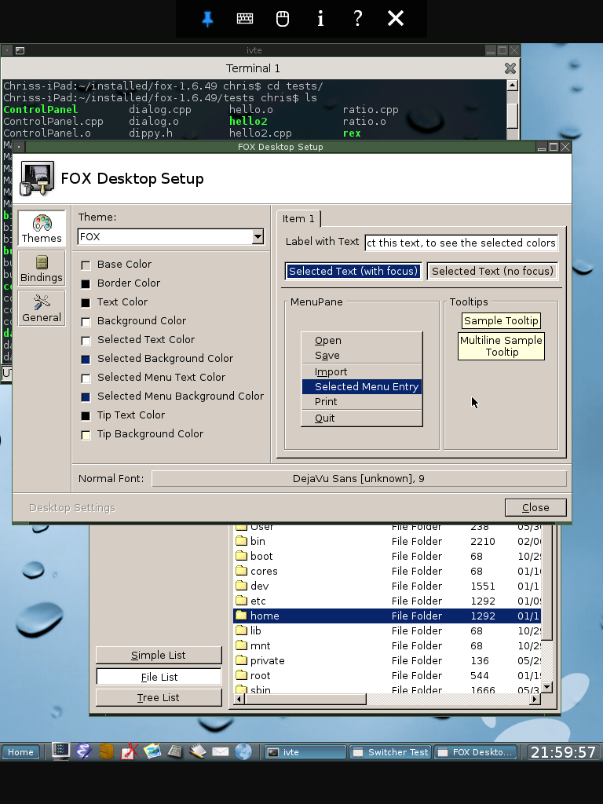
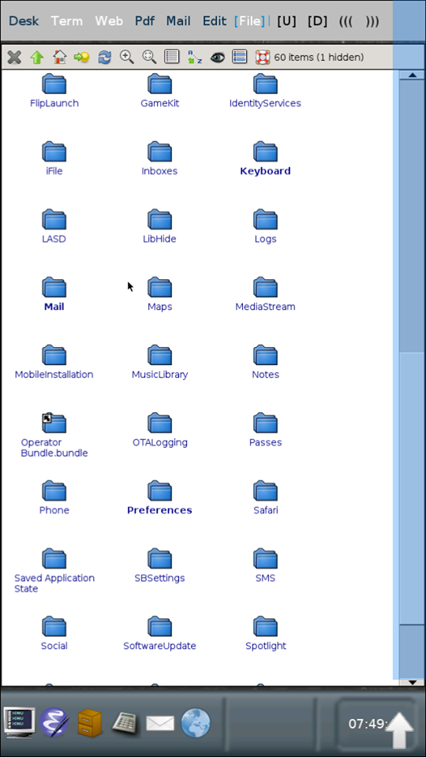
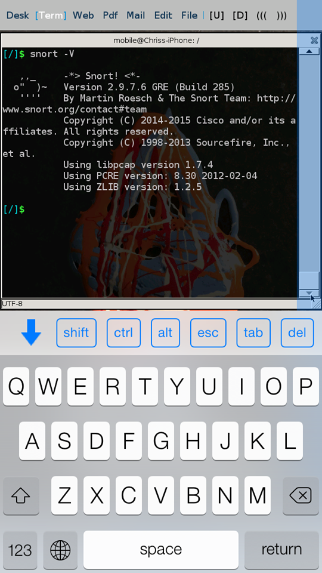
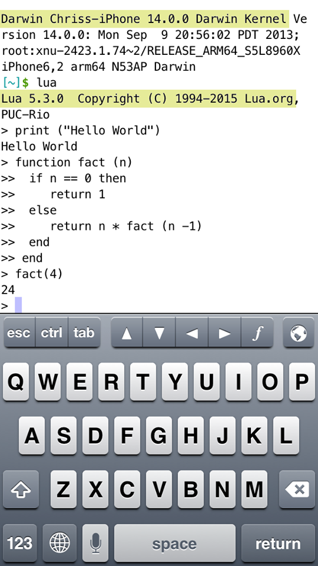
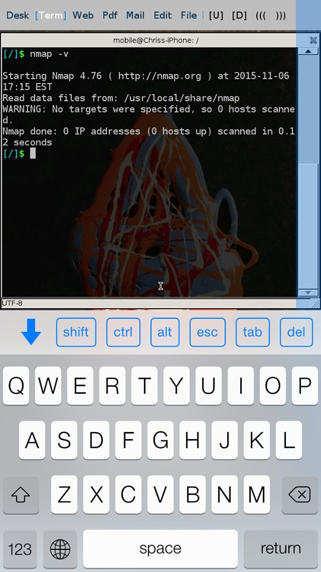

# QMole IPhone Screenshots

## Happy Hacking!

                        
                                           
                         
                                           
                                          
                           
                                         
                                  

